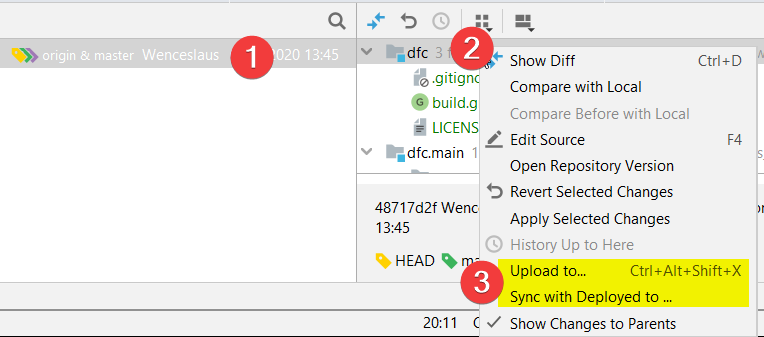

# Plugin for IDE "JetBrains IDEA"
Added VCS menu items for deploying files of selected commits.

## How use
1. Select line/lines of commits
2. Open the right menu in the file panel on the right
3. Choose action for deployment



## How build
```
gradle build --stacktrace -PideaVersion=2021.1 -PsinceApp=211 -PuntilApp=221.*
```

## Resources
- Official docs - https://plugins.jetbrains.com/docs/intellij/welcome.html
- List of actions - https://github.com/lisiur/idea-actions
- List of versions - https://plugins.jetbrains.com/docs/intellij/build-number-ranges.html#intellij-platform-based-products-of-recent-ide-versions
- Gradle build - https://github.com/JetBrains/gradle-intellij-plugin

## Contribution
**Please let me know about any problems in issues. Cheers!**